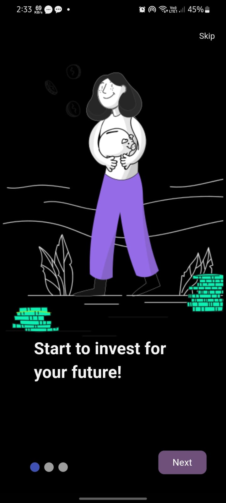

## TradeIQ Stock App
# Overview

TradeIQ Stock App is a comprehensive stock market trading platform designed to provide users with real-time market data, predictive trading signals, and a community-driven social trading experience. Built using Flutter and Firebase, this app leverages TradingView Pine Script for advanced analytics and offers an intuitive user interface for seamless trading.

## Features


- Real-time Market Data: Access live stock prices, market trends, and breaking news.
- Predictive Analytics: Generate buy and sell signals using TradingView Pine Script.
- Social Trading Platform: Follow and replicate trading strategies of experienced investors.
- User Authentication: Secure login and authentication using Firebase.
- Profile Management: Manage user profiles, watchlists, and trading history.
- News Section: Stay updated with the latest news in Forex, Cryptos, and more.
- Economic Calendars: Keep track of important economic events and announcements.

# Technology Stack

- Frontend: Flutter
- Backend: Firebase (Authentication, Firestore, Realtime Database)
- Predictive Analytics: TradingView Pine Script
- APIs: Finnhub, Alpha Vantage

# ScreenShot

 
 
 
  
 
  
  


many losts of features you can see in screenshot folder 

# System Architecture
```
git clone https://github.com/your-username/tradeiq-stock-app.git
Cd TradeIQ
Flutter run

```

# Usage

1. Sign Up / Log In: Create an account or log in using your credentials.
2. Explore Market Data: Access real-time data on various stocks and market trends.
3. Receive Trading Signals: View predictive buy and sell signals generated by the algorithm.
4. Engage in Social Trading: Follow expert traders and replicate their strategies.
5. Manage Your Profile: Update your profile, manage watchlists, and review trading history.
